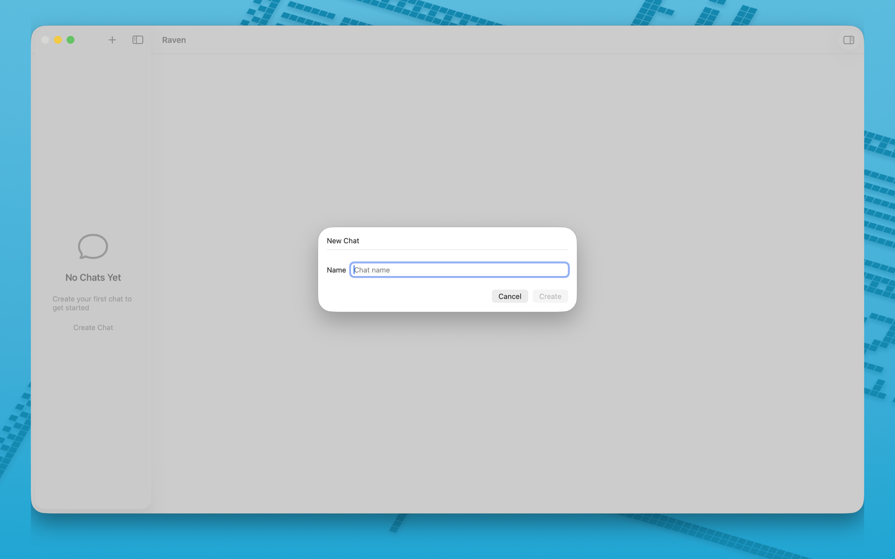
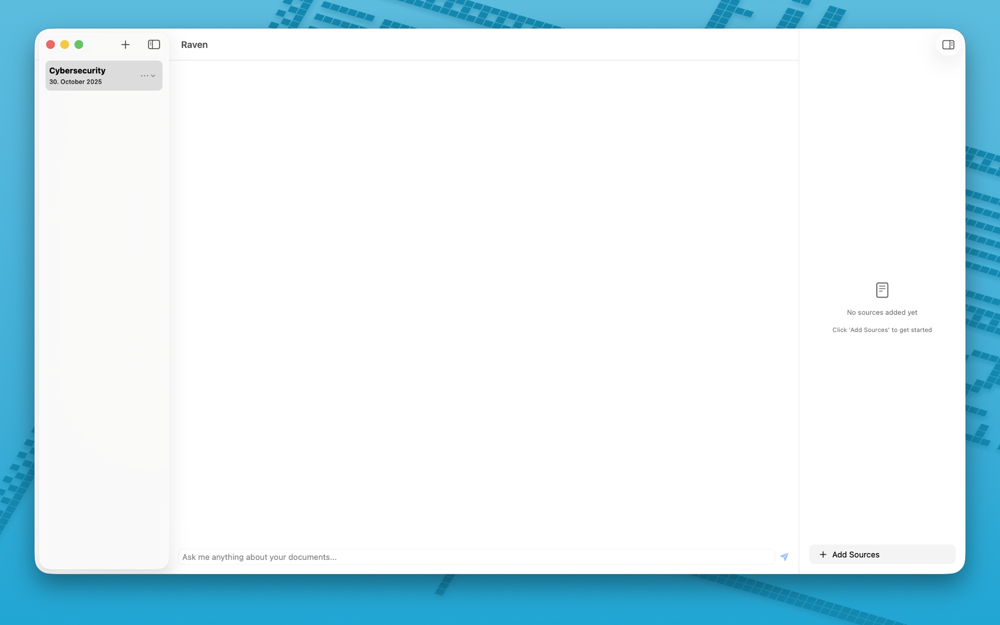
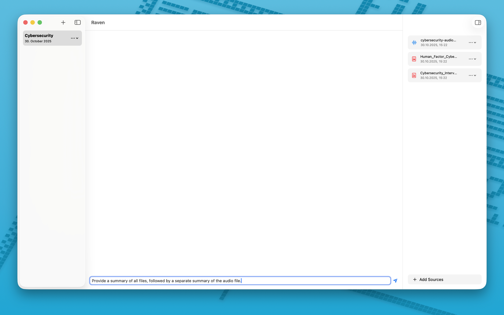

# Raven


## Overview

Raven is an AI assistant app for macOS that transforms documents into interactive content. Upload files and get intelligent responses and summaries.

**🔒 Privacy First**: All processing happens locally using Apple Foundation Models. Nothing is sent to servers or cloud services.

## System Requirements

* macOS 26 Tahoe or later  
* Xcode 26  
* Apple Foundations Model support

## Features

* Text extraction from images PDFs audio files video files
* Audio transcription and video text extraction
* Smart Q&A and contextual content analysis
* Local AI processing only
* Project creation and file organization

## Privacy

* All data stays on device
* No internet required for AI features
* Complete control over documents

## Quick Start

1. Download the latest release as a dmg or app from GitHub Releases or clone the repository
2. Open in Xcode 26 if building manually
3. Run on macOS 26 Tahoe

### Add Content

1. Create a project in the sidebar
2. Add files, they are copied to Documents/Raven Projects

### Ask Questions

1. Select a project
2. Type a question and get responses based on the content

## Project Structure

```
Documents/
  Raven Projects/
    YourProjectName/
      public/
        [uploaded files]
```

## Development Status

🚧 This project is currently in active development

## Contributing

* Report issues
* Suggest features
* Submit pull requests

## Dependencies

* GRDB.swift  
* Apple Foundations Model  
* Vision  
* Speech  
* PDFKit  
* AVFoundation

## License

This project is open source. Please check the LICENSE file for details.

## Support

Open an issue with macOS version and steps to reproduce

## Author

Created by [Eldar Tutnjic](https://github.com/31d4r)

## Screenshots

  
  
  
  
  
  
