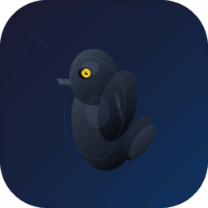
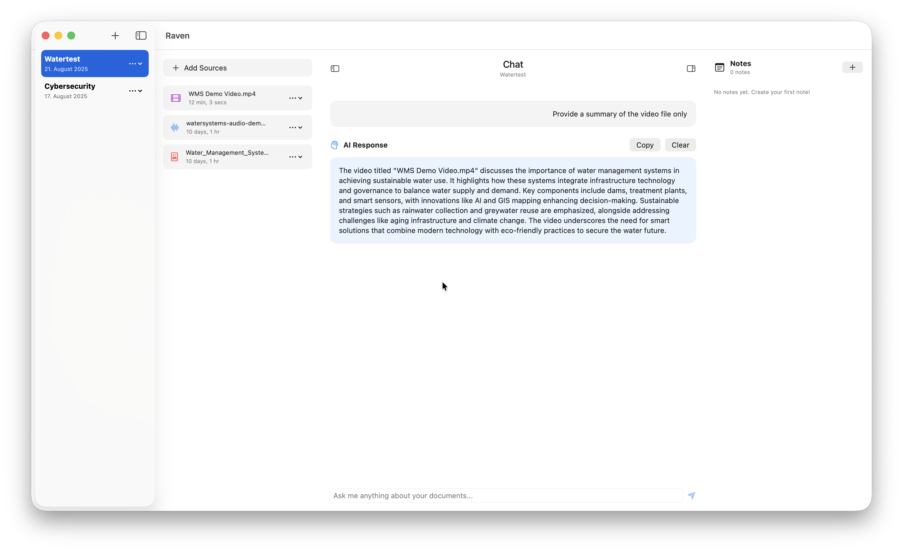

# Raven



## Overview

Raven is a powerful AI assistant app built for macOS that transforms your documents into interactive content. Upload your files and get intelligent responses, summaries.

**🔒 Privacy First**: All your documents stay completely local on your device. Raven uses Apple's on-device Foundation Models, so nothing gets sent to external servers or cloud services.

## System Requirements

* macOS 26 Tahoe or later
* Xcode 26
* Apple Foundations Model support

## What Raven Can Do

### Document Processing
* **Image Text Extraction**: Uses Vision framework to read text from images (JPG, PNG, HEIC, TIFF)
* **PDF Analysis**: Extracts and processes text from PDF documents
* **Audio Transcription**: Converts speech to text from audio files (MP3, WAV, AIFF, M4A)
* **Video Text Extraction**: Pulls text from video files so you can ask for summaries or questions about the content

### AI Features
* **Smart Q&A**: Ask questions about your uploaded documents and get intelligent responses
* **Content Analysis**: AI analyzes all your files and provides contextual answers
* **Multi Format Support**: Works with images, PDFs, audio files and video files simultaneously
* **100% Local Processing**: All AI processing happens on your device using Apple's Foundation Models

### Project Management
* **Project Organization**: Create and manage multiple projects
* **File Management**: Upload and organize files within projects
* **Notes System**: Add personal notes to each project
* **Easy Navigation**: Clean sidebar interface for project switching

## Privacy and Security

🛡️ **Your Data Never Leaves Your Device**

* All document processing happens locally using Apple's on-device AI
* No internet connection required for AI features
* No data sent to external servers or cloud services
* Complete privacy and control over your sensitive documents
* Uses Apple's Foundation Models framework for local LLM processing

## How to Use

### Getting Started
1. Clone this repository
2. Open the project in Xcode 26
3. Build and run on macOS 26 Tahoe
4. Grant necessary permissions for Speech Recognition and Microphone access

### Creating Your First Project
1. Click the "+" button in the Projects sidebar
2. Enter a project name and click "Create"
3. Your project folder structure will be automatically created in Documents/Raven Projects

### Adding Content
1. Select a project from the sidebar
2. Click "Add Sources" in the left sidebar
3. Choose your files (images, PDFs, audio files, video files)
4. Files are automatically copied to your project's public folder

### Asking Questions
1. Type your question in the chat input field
2. Raven will analyze all files in your project
3. Get intelligent responses based on your content
4. Copy responses for later use

### Managing Notes
1. Scroll to the bottom of the right sidebar
2. Click "+" to add a new note
3. Enter title and content
4. Notes are automatically saved and organized by date

## Project Structure

The app creates this folder structure for each project:
```
Documents/
  Raven Projects/
    YourProjectName/
      public/
        [uploaded files]
```

## Database

Raven uses GRDB.swift for local data storage with SQLite. All project metadata, file references, and notes are stored locally on your device.

## Development Status

🚧 **This project is currently in active development**

### Current Features
* Project creation and management
* Multi format file processing (images, PDFs, audio, video)
* AI powered Q&A system
* Notes system
* Modern SwiftUI interface
* Complete local processing with Apple Foundation Models

### Planned Features
* Export capabilities
* Advanced search functionality
* More customization options
* Performance improvements
* Additional AI model options

## Contributing

We welcome contributions! Here's how you can help:

### Ways to Contribute
* Report bugs and issues
* Suggest new features
* Submit pull requests
* Improve documentation
* Test on different macOS configurations

### Getting Started with Development
1. Fork the repository
2. Create a feature branch
3. Make your changes
4. Test thoroughly on macOS 26 Tahoe
5. Submit a pull request with clear description

### Code Style
* Follow Swift best practices
* Use meaningful variable names
* Add comments for complex logic
* Maintain clean architecture patterns

## Dependencies

* **GRDB.swift**: Database management
* **Apple Foundations Model**: Local AI processing
* **Vision**: Text recognition from images
* **Speech**: Audio transcription
* **PDFKit**: PDF text extraction
* **AVFoundation**: Audio playback and synthesis

## License

This project is open source. Please check the LICENSE file for details.

## Support

If you encounter issues or have questions:
* Check existing issues on GitHub
* Create a new issue with detailed description
* Include your macOS version and steps to reproduce

## Author

Created by [Eldar Tutnjic](https://github.com/31d4r)

## Acknowledgments

Built with Apple's latest technologies including Foundation Models framework for on-device AI, Vision framework, and SwiftUI for macOS 26 Tahoe.

---

**Note**: This app requires macOS 26 Tahoe and uses Apple's Foundation Models which run completely on-device without requiring internet connectivity for AI features.

## Screenshots

  
  
  
  
  
  


